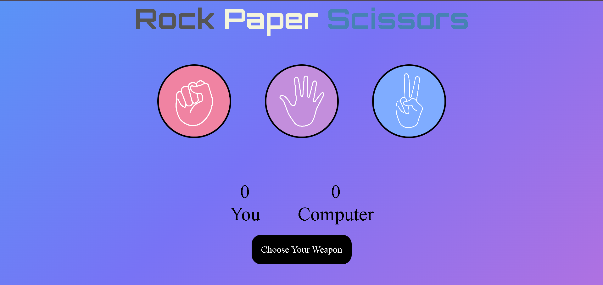

# 🪨 Rock Paper Scissors Game


A visually appealing, sound-enhanced **Rock Paper Scissors** game built using HTML, CSS, and JavaScript — perfect for beginners and casual fun! 🎮

[View Demo](#preview) · [Report Bug](https://github.com/Tayyab-arshad118/rock-paper-scissors/issues) · [Request Feature](https://github.com/Tayyab-arshad118/rock-paper-scissors/issues)

---

## 📑 Table of Contents

* [About The Project](#about-the-project)
* [Built With](#built-with)
* [Getting Started](#getting-started)
* [Preview](#preview)
* [Usage](#usage)
* [Roadmap](#roadmap)
* [Contributing](#contributing)
* [License](#license)
* [Contact](#contact)

---

## 🧩 About The Project

This is a **browser-based game** that lets users play Rock-Paper-Scissors against the computer. It features:

* 🎨 A gradient animated background
* 🎧 Sound effects for interactions
* 🧠 Random computer choices
* 🏆 Score tracking
* 🎯 Responsive layout

---

## 🔧 Built With

This project was built using:

* HTML5
* CSS3
* JavaScript (ES6)
* Google Fonts - [Orbitron](https://fonts.google.com/specimen/Orbitron)

---

## 🚀 Getting Started

To get a local copy up and running follow these simple steps.

### Prerequisites

No external libraries or installations are needed. Just a browser!

### Installation

1. Clone the repository

   ```bash
   git clone https://github.com/your-username/rock-paper-scissors.git
   ```

2. Navigate to the project folder

   ```bash
   cd rock-paper-scissors
   ```

3. Open `index.html` in your browser

---

## 📸 Preview



> *(Save a screenshot of your game as `screenshot.png` inside the `images/` folder)*

---

## 💡 Usage

Click any one of the choices — **Rock**, **Paper**, or **Scissors** — and see if you beat the computer! Each round plays a sound and updates the scoreboard live.

---

## 📍 Roadmap

* [x] Add sound effects for game events
* [x] Responsive layout for mobile and desktop
* [ ] Add restart button
* [ ] Add game history / log
* [ ] Add dark mode toggle

See the [open issues](https://github.com/your-username/rock-paper-scissors/issues) for a full list of proposed features (and known issues).

---

## 🤝 Contributing

Contributions are what make the open source community such an amazing place. If you have a suggestion, fork the repo and submit a pull request!

1. Fork the Project
2. Create your Feature Branch

   ```bash
   git checkout -b feature/AmazingFeature
   ```
3. Commit your Changes

   ```bash
   git commit -m 'Add some AmazingFeature'
   ```
4. Push to the Branch

   ```bash
   git push origin feature/AmazingFeature
   ```
5. Open a Pull Request

---

## 📄 License

Distributed under the MIT License. See `LICENSE` for more information.

---


## 📬 Contact

**Tayyab Arshad** — [LinkedIn](https://www.linkedin.com/in/tayyab-arshadd/) — [malikashad118118@gmail.com](mailto:malikashad118118@gmail.com)

Project Link: [https://github.com/Tayyab-arshad118/rock-paper-scissors](https://github.com/Tayyab-arshad118/rock-paper-scissors)

---

